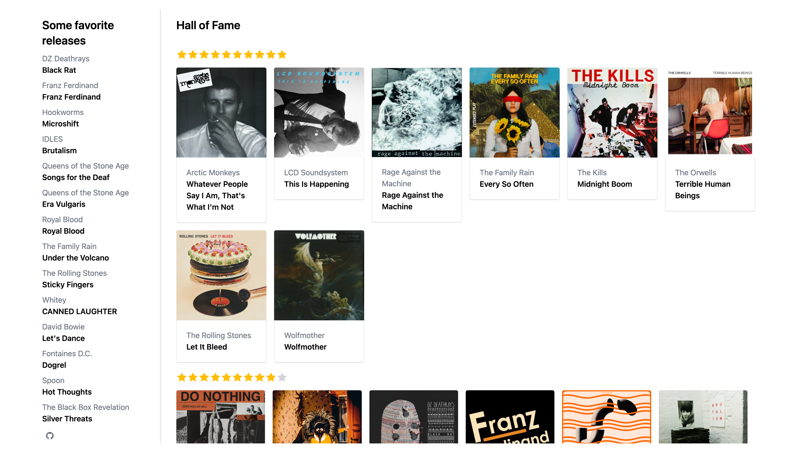

# Albums' hall of fame

[](https://albums-hall-of-fame.netlify.app/)

Database with collected info:


## How to build

Some environment variables should be defined in `.env` file in order to let script retrieve data from Airtable (see `.env.example`)

```sh
# Retrieve data from Airtable
> node retrieve-data.js
# Build with eleventy
> npm run build
```
